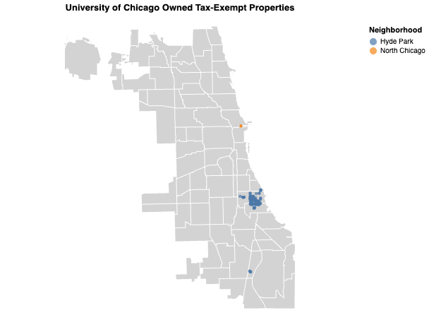

# Are Universities Paying Their Fair Share?

Jinny Kim

## What is your current goal? Has it changed since the proposal?
My current goal is to understand how much tax-exempt property universities in Chicago owns (with a focus on UChicago) and how valuable they are. This analysis comes amid a nationwide conversation around whether private universities should be paying their fair share of taxes, including here in Chicago. Brown University, Harvard University and Notre Dame have agreed to participate in a tax-paying program named PILOT to help finance their use of services in the city (Source: Triibe, Dec 2024). 

My project goal has changed significantly since the proposal, which was focused on heat-related workplace injuries. 

## Are there data challenges you are facing? Are you currently depending on mock data?
The main data challenge I’m facing is that I’m working with several different property datasets from the Cook County Assessor's Office, and I’m not sure how much their coverage overlaps. In particular, many of UChicago's properties from the tax-exempt dataset either have missing commercial valuation data or show assessed values of zero. I’m unsure whether this reflects a data quality issue or if it’s due to their tax-exempt status. I plan to speak with a UChicago professor who specializes in property taxes to better understand how to interpret these datasets. 

I'm not currently using mock data but I am not 100% confident in my results because I don't have a good understanding of property taxes or property data. 

## Describe each of the provided images with 2-3 sentences to give the context and how it relates to your goal.

I want to show that there is a large cluster of properties owned by UChicago in Hyde Park and then some in North Chicago. However, a large portion of this map is empty, so I could zoom into certain parts of the city.  

This is to show the cluster of properties owned by UChicago in Hyde Park. I wanted to use Google Map as a base map so that people can see whereabouts these properties are located, but I couldn't figure out how to do that in Altair. I could perhaps add a road layer to the map, but that might look cluttered. 

This is to compare properties in Chicago owned by other universities. The initial expectation was that UChicago's properties would far exceed others, but to my surprise, University of Illinois also had a lot of properties in Chicago. 

Again, this is to compare properties in Chicago owned by other universities. Here we can see the exact number of tax-exempt properties in tax year 2025, and we can see that the University of Illinois in fact has a very high number of properties in the city. 

This graph shows the number of properties purchased by universities from 1999 to present. It's a cumulative line graph, and it shows that there is a jump for Loyola University around 2018. The graph may be a bit misleading though if other universities like UChicago own a lot more property, but most of theirs was purchased prior to 1999.

This graph shows at what prices different universities purchased property in Chicago. However, this result might be a product of Loyola University purchasing property later than other universities, resulting in higher purchase prices, rather than them owning more valuable property. I used a log-scale for the x-axis because some of the property values for Loyola were very high so it was hard to differentiate the other universities. 

This chart shows the racial composition of the neighborhoods where university-owned properties are located, measured at the census tract level. Because there are four variables to compare, I used a repeat chart. However, I wasn’t sure how to create a single central title, change the x-axis titles (for repeat charts) or arrange them in a 2×2 layout so it's a bit hard to read. 

This chart is a facet bar chart that shows the median income distribution of neighborhoods where university-owned properties are located. I'm not sure if this is the best way to visualize the distribution, perhaps it's better to show the proportion of properties in certain income brackets, rather than individual counts.  

## What form do you envision your final narrative taking? (e.g. An article incorporating the images? A poster? An infographic?)
I would like to write an article as my final narrative format--I want to interview different sources for the piece. I'd love to publish this in the Chicago Maroon. 